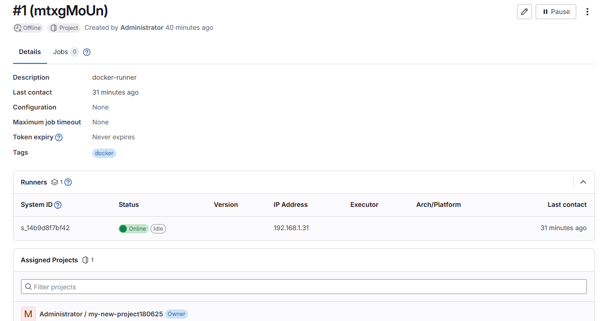
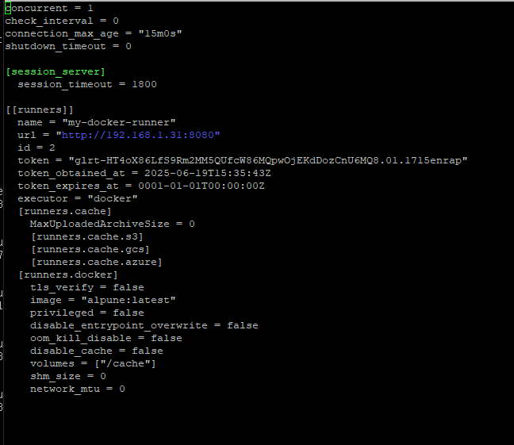

# Домашнее задание к занятию "`GitLab`" - `Янин Семён Васильевич`


### Инструкция по выполнению домашнего задания

   1. Сделайте `fork` данного репозитория к себе в Github и переименуйте его по названию или номеру занятия, например, https://github.com/имя-вашего-репозитория/git-hw или  https://github.com/имя-вашего-репозитория/7-1-ansible-hw).
   2. Выполните клонирование данного репозитория к себе на ПК с помощью команды `git clone`.
   3. Выполните домашнее задание и заполните у себя локально этот файл README.md:
      - впишите вверху название занятия и вашу фамилию и имя
      - в каждом задании добавьте решение в требуемом виде (текст/код/скриншоты/ссылка)
      - для корректного добавления скриншотов воспользуйтесь [инструкцией "Как вставить скриншот в шаблон с решением](https://github.com/netology-code/sys-pattern-homework/blob/main/screen-instruction.md)
      - при оформлении используйте возможности языка разметки md (коротко об этом можно посмотреть в [инструкции  по MarkDown](https://github.com/netology-code/sys-pattern-homework/blob/main/md-instruction.md))
   4. После завершения работы над домашним заданием сделайте коммит (`git commit -m "comment"`) и отправьте его на Github (`git push origin`);
   5. Для проверки домашнего задания преподавателем в личном кабинете прикрепите и отправьте ссылку на решение в виде md-файла в вашем Github.
   6. Любые вопросы по выполнению заданий спрашивайте в чате учебной группы и/или в разделе “Вопросы по заданию” в личном кабинете.
   
Желаем успехов в выполнении домашнего задания!
   
### Дополнительные материалы, которые могут быть полезны для выполнения задания

1. [Руководство по оформлению Markdown файлов](https://gist.github.com/Jekins/2bf2d0638163f1294637#Code)

---

### Задание 1

`Приведите ответ в свободной форме........`

1. `Скачиваем gitlab-cc и понимаем, что недостаточно места на диске.`
2. `Расширяем диск`
3. `Установка gitlab-cc`
4. `Изменение external_url в gitlab.rb под собственный ip и порт`
5. `Отбираем порт 8080 у jankins/java`
6. `Очень долгая загрузка страницы, проверка логов, смена портов puma`
7. `Успешныая загрузка http-страницы`
8. `Создание проекта "my-new-project180625"`
9. `Установка gitlab-runner и регистрация`


`При необходимости прикрепитe сюда скриншоты
![runner.png] 
![config.toml.png] 

---

### Задание 2

`Приведите ответ в свободной форме........`

1. `Загружаем репозиторий меняем origin и пушем на gitlab`
2. `Создаём .gitlab-ci.yml для теста`
3. `Ловим ошибку и идём проверять runner`
4. `Повторно запускаем pipline отключив Auto DevOps`
5. `Успех`

```
stages:
  - test
test-job:
  stage: test
  image: alpine
  script:
    - echo "Test project file <3"
    - ls -la
    - echo "Create .txt file for artifacts" > test.txt
  artifacts:
    paths:
      - test.txt
    expire_in: 1 hour
```

![pipline.png] 


---
